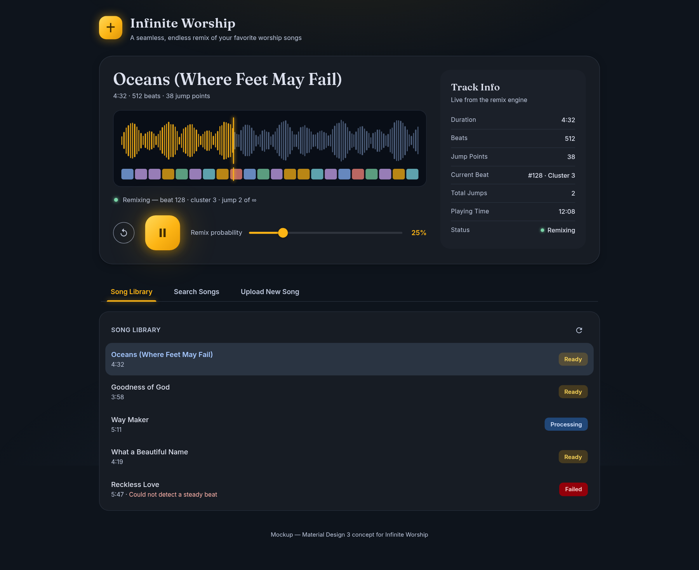
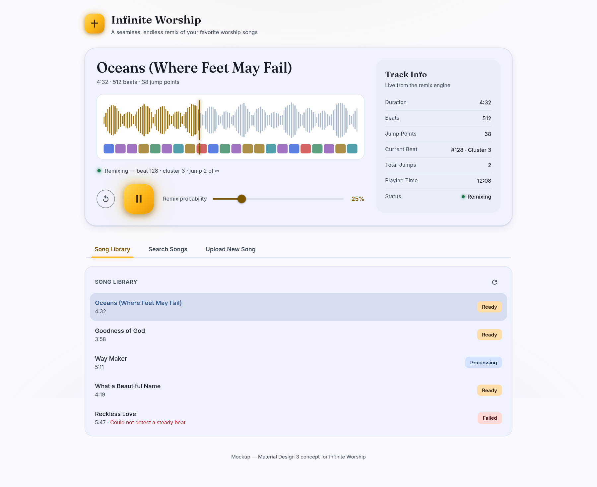
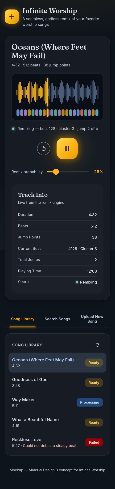

# Infinite Worship — Material Design 3 Revamp (Spec)

Status: **approved design brief, not yet implemented**
Decided via structured interview, 2026-10-04. Implementation is out of scope for this document.

## Mockups

Rendered from `specs/mockup.html` (self-contained, real tokens + fonts; open with any static server, `?theme=light` for the light scheme).

| Desktop — Dark (default) | Desktop — Light | Mobile — Dark |
|---|---|---|
|  |  |  |

## 1. Decisions log

| # | Decision | Outcome |
|---|---|---|
| 1 | Scope | Full sweep, one pass — every surface incl. upload/error/empty states |
| 2 | Implementation | Hand-rolled MD3 tokens on Tailwind 4 `@theme`; no component library; only new dep `material-color-utilities` (build-time palette generation) |
| 3 | Color identity | Berkeley Blue `#003262` + California Gold `#FDB515` as exact brand anchors (strong UC Berkeley tribute) |
| 4 | Schemes | Dark + light, **system-following only**, no manual toggle |
| 5 | Multi-hue budget | Navy/gold dominant; jewel tones only in the beat-cluster bar + subtle gradient accents (the stained-glass register) |
| 6 | Christian elements | Stained-glass palette + light/glow language as the system; one minimal geometric cross in a gold-glowing squircle as logo/favicon; **no religious copy** |
| 7 | Motion | MD3 emphasized easing for interactions + one signature beat-synced glow on the playing FAB |
| 8 | Typography | Fraunces (display/serif) + Inter (UI/body) via `next/font/google` |
| 9 | Copy | Light touch — fix awkward strings only |
| 10 | Visualization | Keep wavesurfer + beat-cluster bar; recolor into the tonal palette |
| 11 | Legacy identity | Skeuomorphic CD-deck (bevels, engraved labels, `.cdpanel`, tactile transport buttons) fully replaced; layout skeleton (header / player / tabs) retained conceptually |
| 12 | Player layout | MD3 hero "now playing" card |
| 13 | Navigation | MD3 primary tabs with animated gold indicator |
| 14 | Mobile | Parity — deliberate mobile layout, not best-effort |

Judgment calls (approved with the brief): MD3 default shape scale; `surfaceContainer*` tonal elevation; unify remix-probability to one MD3 slider on all viewports (mobile `<select>` is dropped); the ℹ️ `alert()` becomes an MD3 dialog; song status → tonal chips; upload → outlined drop zone + filled button + linear progress.

## 2. Color system

### 2.1 Palette derivation

Generated with `@material/material-color-utilities` (HCT color space):

| Palette | HCT source | Role |
|---|---|---|
| Primary | hue 260, chroma 37 (from `#003262`) | blues |
| Secondary | hue 80, chroma 48 (from `#FDB515`) | golds |
| Tertiary | hue 200 (teal — deliberately outside the violet/magenta family; user rejected violet), chroma 32 | teal (stained-glass hint) |
| Neutral | hue 260, **chroma 10** (above spec-min so dark surfaces keep a navy cast) | surfaces/text |
| Neutral variant | hue 260, chroma 16 | outlines, variant text |
| Error | hue 25, chroma 84 (MD3 standard) | errors |

### 2.2 Role tokens

| Token | Dark | Light |
|---|---|---|
| `primary` | `#a6c8ff` | `#3b5f92` |
| `onPrimary` | `#003060` | `#ffffff` |
| `primaryContainer` | `#214778` | `#d5e3ff` |
| `onPrimaryContainer` | `#d5e3ff` | `#001c3b` |
| `secondary` | `#fabc49` | `#7d5700` |
| `onSecondary` | `#422c00` | `#ffffff` |
| `secondaryContainer` | `#5f4100` | `#ffdeab` |
| `onSecondaryContainer` | `#ffdeab` | `#271900` |
| `tertiary` | `#8cd2d5` | `#19686b` |
| `onTertiary` | `#003738` | `#ffffff` |
| `tertiaryContainer` | `#004f52` | `#a8eff1` |
| `onTertiaryContainer` | `#a8eff1` | `#002021` |
| `error` | `#ffb4ab` | `#ba1a1a` |
| `onError` | `#690005` | `#ffffff` |
| `errorContainer` | `#93000a` | `#ffdad6` |
| `onErrorContainer` | `#ffdad6` | `#410002` |
| `surface` | `#0e141c` | `#f9f9ff` |
| `surfaceDim` | `#0e141c` | `#d6dae6` |
| `surfaceContainerLowest` | `#090e17` | `#ffffff` |
| `surfaceContainerLow` | `#171c24` | `#f0f3ff` |
| `surfaceContainer` | `#1b2029` | `#e9eefa` |
| `surfaceContainerHigh` | `#252a33` | `#e4e8f4` |
| `surfaceContainerHighest` | `#30353e` | `#dee2ef` |
| `onSurface` | `#dee2ef` | `#171c24` |
| `onSurfaceVariant` | `#bdc7dc` | `#3d4758` |
| `outline` | `#8791a5` | `#6d778a` |
| `outlineVariant` | `#3d4758` | `#bdc7dc` |
| `inverseSurface` | `#dee2ef` | `#2b313a` |
| `inverseOnSurface` | `#2b313a` | `#ecf1fd` |
| `inversePrimary` | `#3b5f92` | `#a6c8ff` |

### 2.3 Brand-fixed accents

Exact Cal hexes, used where the brand must be unmistakable (**logo, FAB, glows**) — same value in both schemes. Scheme-varying gold foregrounds/graphics (active tab label **and indicator**, slider `%` readout, playhead, played bars, hover states) follow the gold-as-foreground rule below instead.

| Token | Value | On-color | Contrast |
|---|---|---|---|
| `brandBlue` | `#003262` | `#ffffff` | 12.9:1 |
| `brandGold` | `#FDB515` | `#422C00` (dark text on gold) | 7.4:1 |

**Gold-as-foreground rule (contrast-critical):** `brandGold` is a **fill/indicator/glow color only** — never text, never icons-on-light. Measured `#FDB515` on the light surface `#f9f9ff` = **1.7:1**, a hard failure. All light-scheme gold *foreground* uses (active tab label, slider `%` readout, played waveform bars, playhead, hover states) use the derived **`goldInk` = `#7d5700`** (= MD3 light `secondary`, 6.19:1 on surface, ≥5:1 on containers) instead. Dark scheme keeps `brandGold` foreground freely (7.4:1+ on dark surfaces).

### 2.4 Jewel palette (beat-cluster bar only)

Categorical; maps cluster index → color round-robin. Two variants per scheme for legibility against dark/light surfaces.

| Name | Dark | Light |
|---|---|---|
| ruby | `#FF8A80` | `#C62828` |
| gold | `#FDB515` | `#8A6400` |
| emerald | `#7BD5A8` | `#1E7A4C` |
| sapphire | `#8AB8FF` | `#1D4ED8` |
| amethyst | `#CFA9F5` | `#7B3FA8` |
| cyan | `#7FDCE8` | `#0E7C8C` |

**Usage rule:** jewel tones appear ONLY in the beat-cluster bar, status dots (emerald = playing), and error/failed inline text. Anywhere else needs explicit approval — this is the "low-key" guardrail.

### 2.5 Theme plumbing

- CSS custom properties on `:root` for dark; `@media (prefers-color-scheme: light)` overrides. No JS theme state, no toggle, no `localStorage`.
- Tailwind 4: map the tokens in `@theme` (`--color-primary`, `--color-surface-container-low`, …) so components use utilities (`bg-surface-container-low`, `text-on-surface-variant`).
- The page background adds two faint radial glows (gold from top-center, primary from bottom, ≤ 9% opacity) — the "light" motif at the system level.
- Scheme selection must be applied before first paint (CSS-only media query does this naturally; no hydration flash risk).

## 3. Typography

Loaded via `next/font/google`, self-hosted at build, `display: swap`.

| Role | Face | Size/weight (desktop) |
|---|---|---|
| Display — song title in hero | Fraunces (variable opsz 9–144) | 34px / 560 / line-height 1.12 (27px mobile) |
| Headline — wordmark | Fraunces | 27px / 600 (23px mobile) |
| Card titles ("Track Info") | Fraunces | 20px / 560 |
| UI body, labels, list rows | Inter | 13–14.5px / 400–600 |
| Chips, meta keys | Inter | 12–12.5px / 500–600, letter-spacing 0.02–0.04em |

No system-font fallback dependence; both faces are variable fonts, one request each.

## 4. Shape, elevation, motion

- **Shape**: hero card 28px; panels/dialogs 20px; waveform screen inset 16px; chips 8px; icon buttons full-round; FAB 22px (MD3 large FAB shape).
- **Elevation**: tonal only — page `surface`, hero `surfaceContainerLow`, nested cards `surfaceContainer`, insets `surfaceContainerLowest`. One faint `outlineVariant` (45–60% opacity) border per card; soft shadows in light scheme, near-none in dark. **No bevels, no gradients on surfaces** (gradients reserved for the gold FAB/logo).
- **Motion**:
  - Standard interactions: MD3 emphasized easing `cubic-bezier(0.2, 0, 0, 1)` — 200ms (small), 300–400ms (container/layout).
  - Tab indicator: 300ms emphasized slide + width morph.
  - **Beat-synced glow** (the signature dynamic moment): the playing FAB's gold halo breathes on each beat — `transform: scale(1→1.06)` + `box-shadow` intensity keyed off `AudioEngine.onBeatChange`; decays with `transition: transform 180ms, box-shadow 180ms`. Transform/opacity/shadow only — never layout properties — so the 100ms lookahead scheduler is never contended.
  - `prefers-reduced-motion`: disables beat glow pulse, indicator slide becomes an instant switch, skeleton pulses removed.

## 5. Surfaces & components

### 5.1 Header
Squircle cross logo (§7) + "Infinite Worship" in Fraunces + tagline. Left-aligned desktop, centered-ish mobile. Info ℹ️ button opens an **MD3 dialog** (surfaceContainerHigh, 28px radius) replacing the current `alert(APP_DESCRIPTION)`.

### 5.2 Hero now-playing card (replaces the `.cdpanel` grid)
- Fraunces song title; sub-line "duration · beats · jump points".
- **Screen inset** (`surfaceContainerLowest`): recolored wavesurfer waveform (played = `brandGold` 88% dark / `goldInk`-gold mix light, upcoming = `primary` 42%; playhead = 2px gold with glow — `brandGold` dark / `goldInk` light) above the jewel-tone beat-cluster bar (gold playhead, per §6 scheme split). Click-to-seek retained.
- Status strip: emerald live dot + "Remixing — beat N · cluster K · jump J of ∞".
- **Transport**: outlined restart icon button (44px), gold FAB (72px, `brandGold` gradient, `onGold` icon, glow halo; pause icon while playing), then the **unified MD3 slider** for remix probability (gold active track + thumb, `%` readout: `brandGold` in dark, `goldInk` in light). The mobile `<select>` is deleted — one control everywhere.
- **Track Info aside** (`surfaceContainer` card): existing 7 key/value rows; keys in `onSurfaceVariant`, status value gets the emerald dot. Moves below the player on mobile (grid collapses to 1 column).
- No-song state: hero shows the same card with a skeleton waveform (static `surfaceContainerHighest` bars, no pulse under reduced motion) and disabled transport.

### 5.3 Tabs + panels
- MD3 primary tabs: 48px height, Inter 600 labels; active = gold label + 3px rounded gold indicator with faint glow (indicator graphic follows the §2.3 scheme split: `brandGold` dark / `goldInk` light); indicator animates between tabs (§4).
- **Song Library / Search**: panel `surfaceContainerLow`; list rows 14px radius, hover = `onSurface` 6%, selected = `primary` 14% wash + primary title. Status chips: Ready = gold tonal (dark: gold 20% bg + `#FFD95A` text; light: `secondaryContainer`), Processing = `primaryContainer` pair, Failed = `errorContainer` pair; failure reason inline in `error` color.
- **Upload**: outlined dashed drop zone (`outlineVariant`, 16px radius), filled gold button (`brandGold`/`onGold`), MD3 linear progress indicator during presign→PUT→finalize; terminal status chip after enqueue.
- Errors: `errorContainer` banner above the panel; loading-song state: thin gold linear progress under the tab bar.

### 5.4 Layout
Desktop: max-width 1080px, hero = `1fr 300px` grid. Mobile (<820px): single column, hero stacks (player → track info), transport centers (restart + FAB on one row, slider full-width below — thumb-reach), tabs distribute full width, waveform bars thin out (every second bar hidden ≤820px) so the screen inset never overflows.

## 6. Visualization recolor (wavesurfer)

| Element | Dark | Light |
|---|---|---|
| Played bars | `#FDB515` @ 88% | `goldInk`-gold mix (~72% ink) |
| Unplayed bars | `primary` @ 42% | `primary` @ 55% |
| Playhead | 2px `brandGold` + glow | 2px `goldInk` |
| Jump-candidate markers | cyan `#7FDCE8` | `#0E7C8C` |
| Beat-bar segments | jewel palette (dark) | jewel palette (light) |
| Beat-bar position marker | 2px `brandGold` | 2px `goldInk` |

Removes the current pastel `bg-blue-100/...` Tailwind palette entirely.

## 7. Brand assets

- **Logo**: gold-gradient squircle (15px radius at 48px), centered geometric cross in `#3A2800`, gold outer glow (box-shadow, ~40% gold). SVG source: single file, `currentColor`-free, used for header (48px) and favicon.
- **Favicon**: `src/app/icon.svg` (Next.js App Router convention — no manual `<link>` needed); optionally `apple-icon.png` 180px export.
- No other imagery; "light" language is carried by the glows, not pictures.

## 8. Accessibility

- All text/background pairs meet WCAG AA 4.5:1 (MD3 role pairings; brand + goldInk pairs individually verified in §2.3 — the §2.2 table alone is **not** sufficient, since derived pairs like light `secondary`/`secondaryContainer` were measured, not assumed).
- `:focus-visible` ring: 2px gold + 2px offset — `brandGold` in dark, `goldInk` in light (gold-as-foreground rule §2.3; raw gold on light fails the 3:1 non-text minimum). Replaces the current gold ring token.
- `prefers-reduced-motion` per §4. `color-scheme: dark/light` set on `:root` so native controls (scrollbar, the upload file input) match the scheme.
- Tab bar uses real `<button>`s with `aria-selected`; chips are non-interactive status text (no fake button semantics).

## 9. Files this touches (implementation map)

- `src/app/globals.css` — delete the entire `--iw-*`/`.cdpanel`/`.transport-*` token set; new `@theme` + CSS-var scheme plumbing.
- `tailwind.config.ts` — navy/gold palette replaced by MD3 token mapping.
- `src/app/layout.tsx` — `next/font` Fraunces + Inter, `colorScheme` metadata.
- `src/app/page.tsx` — hero restructure, tab bar, dialog.
- `src/components/PlaybackControls.tsx` — FAB + unified slider (mobile `<select>` removed).
- `src/components/Visualization.tsx` — wavesurfer/beat-bar recolor.
- `src/components/SongLibrary.tsx`, `SongSearch.tsx` — rows + chips.
- `src/components/FileUpload.tsx` — MD3 drop zone + progress.
- `src/app/icon.svg` — new. Deleted: all `.cdpanel`, `.device-screen`, `.engraved-label`, `.transport-*` CSS.

## 10. Verification plan (for the implementation pass)

1. `npm run lint` + `npx tsc --noEmit` clean.
2. Real dev server (already running externally — do not restart), browser verification on :3000: dark + light via `prefers-color-scheme` emulation, 1440px + 390px viewports.
3. Exercise: library load, song select → hero card, play (beat glow visible), tab switching (indicator slide), upload drop zone, failed-song error chip.
4. Audio path unchanged — `audio.ts`/`player.ts` logic untouched; only `onBeatChange` gains a DOM hook for the glow.
